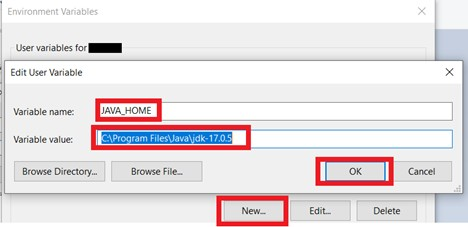
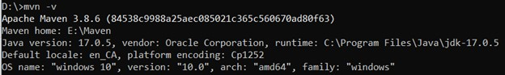
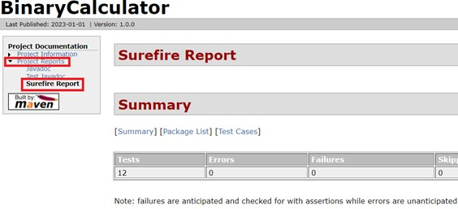

# soft-quality-deliverable-1
Software Quality Project Deliverable 1

## Lab 1: Software Project Management and Comprehension Tool (Apache Maven)

GitHub Link: https://github.com/GeorgeDaoud3/SOFE3980U-Lab1.git

## Objective: 
1. Install Maven in Windows OS.
2. Be familiar with Maven as a software project management tool.
3. Understand how to create, configure and build Maven projects.
4. Be able to automatically generate Documentation of the project.
5. Be able to configure the project to automatically add dependencies to the jar file.
6. Learn how to write and run tests a the project.

## What’s Maven?
It’s A tool for building and managing any type of java-based project.
It also can be used to build projects written in C#, Scala, Ruby, etc. 
Maven not only automatically handles the requirements for the project 
like downloading the dependencies, but it also automates most of the 
development tasks in the project like:
* Builds
* Dependencies
* Report
* Distribution
* Releases
* Mailing list

## Maven Installation
* Have a JDK installed on your system. It should satisfy [the minimum requirement](https://maven.apache.org/download.cgi#system-requirements). 
* Set the **JAVA_HOME** environment variable pointing to your JDK installation. 
    1.	On the Windows taskbar, right-click the **Windows icon** and select **System**.
    2.	In the Settings window, under **Related Settings**, click **Advanced system settings…** .
    3.	On the **Advanced** tab, click **Environment Variables…** .
    4.	Click **New** to create a new environment variable for the current user.
    5.	Set the **Variable name** to **JAVA_HOME** and the **Variable value** to the installation path (it would be different than that shown in the figure). The **bin** folder containing **java.exe** should be accessed by the path.  
      
    6.	To check it, open a new command window and execute  
    ``` cmd
    echo %JAVA_HOME%
    ```
    It should display the JDK path
* Download the **Binary zip archive** format of [Maven](https://maven.apache.org/download.cgi#files) then uncompress it to a certain folder.
* Add the Maven path to the system path
    1.	Go to the **Environment variables** for the user as you did before.
    2.	Find an existing **Path** Variable. Then click **edit**.
    3.	Add a new record of the path of the **bin** folder within the **Maven** folder. (the path would like different than that shown in the figure)  
      
* Check the correct Installation, by running the following command in a new command window (Note any change in the user variables will effect only new command windows)  
``` cmd
mvn -v
```
It should display an output similar to  


``` cmd
mvn clean test package site assembly:single
```  
Now, you can access the result of the test cases from the summary report.  
  

# Design: 
It's required from your team to
1. Add three functions to the **Binary** class that perform the following operations over two binary variables. The output of the function should be also a binary function:  
    * **OR**: bitwise logical OR
    * **AND**: bitwise logical AND  
    * **Multiply**: multiply two binary variables (**Note**: you may use the Add function)
2. Update the App.java file to call the new three functions. You may update it to be more interactive and user friendly.
3. Add three test functions at least for each of new function added into the Binary class

# Deliverables:
1. A GitHub link includes the whole project folder (except the target folder) with the final version of the binary class and the test cases.
2. A report discussing the source and testing code of the design part.
3. Audible video of about 3 minutes showing the building and running phases of the project as well as the passed tests. Also, show the generated documentation for the functions you added in the design section. 
